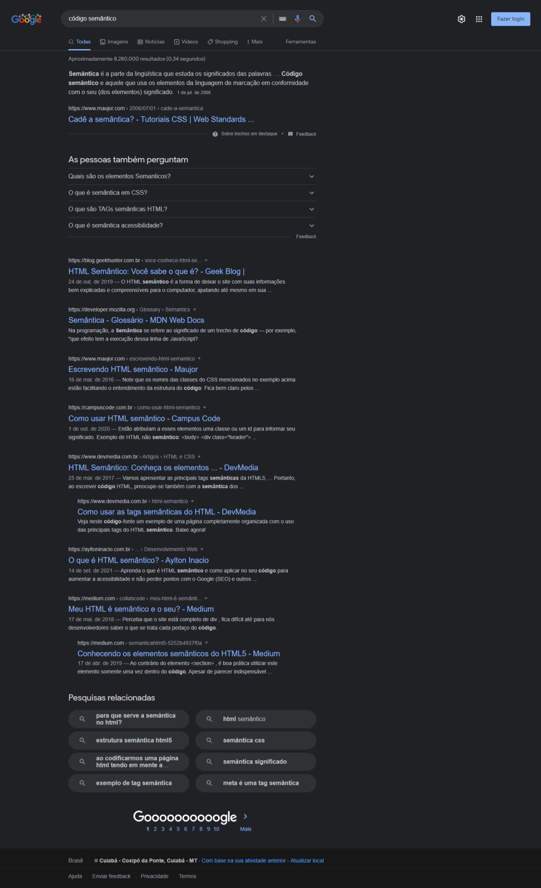
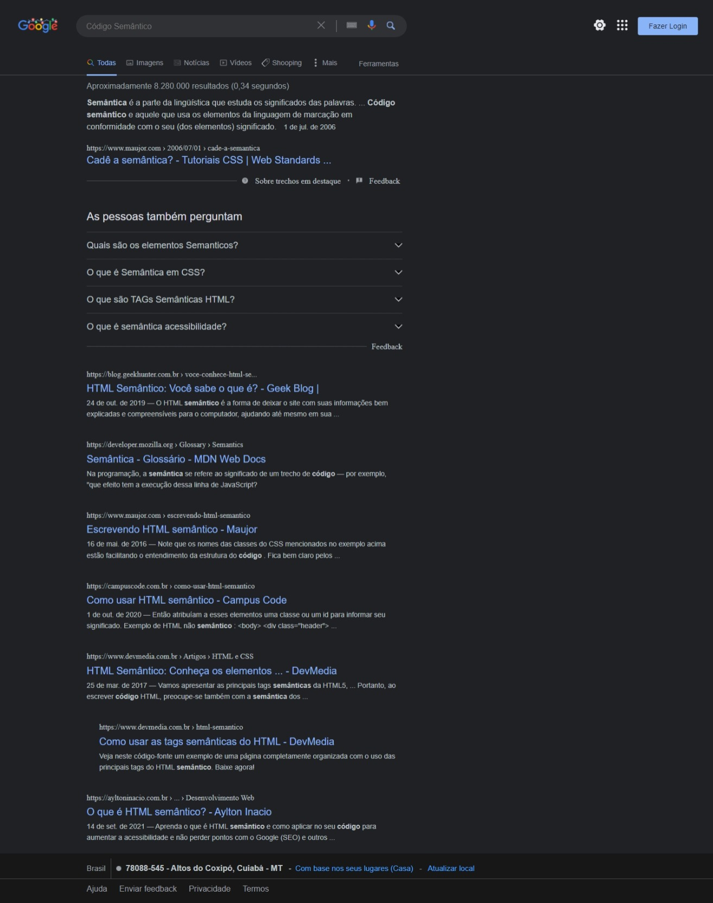

<h1 align="center">
    
</h1>

<h2 align="center">
Clone da página de resultados do Google
</h2>

 

### Página de referência

<h1 align="center">
    
</h1>

---

### Resultado da página clonada

<h1 align="center">
    
</h1>
